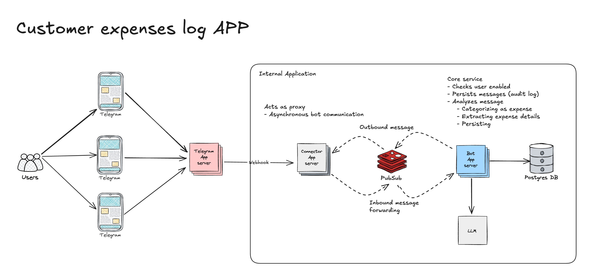

# The customer expenses log

This is the challenge code for DarwingAI. The full details and requirements [here](./public/SWE%20Seniority%20Test.pdf).

The most general implentation requirements ask for:

- Implementing a NodeJS connector application to serve as a proxy between Telegram and the [Bot server](./bot/README.md)

- Implementing a Bot server which receives messages, process them (using some LLM) and generates a response.

The proposed solution considers asynchronous communication between those server components. The LLMs normally tend to take a while analyzing a prompt and generating a response, because synchronous HTTP communications are not considered suitable.

The following diagram shows the highest design level proposed 

For information about each service:

[Bot service](./bot/README.md)

[Connector service](./connector/README.md)

## Project setup

### Running

- The development environment leverages on docker compose to run four containers:

  1. Postgres DB
  2. Redis (used as publish/subscribe system)
  3. The Bot Server
  4. The Connector server

- Open a terminal in the `dev` folder and run the whole application executing

```cmd
make start.all
```

- Connect to your database and execute

```SQL
CREATE TABLE users (
  "id" SERIAL PRIMARY KEY,
  "telegram_id" text UNIQUE NOT NULL
);

CREATE TABLE expenses (
  "id" SERIAL PRIMARY KEY,
  "user_id" integer NOT NULL REFERENCES users("id"),
  "description" text NOT NULL,
  "amount" money NOT NULL,
  "category" text NOT NULL,
  "added_at" timestamp NOT NULL
);

CREATE TABLE processed_messages (
	"id" varchar(50) PRIMARY KEY,
	"user_id" integer NOT NULL REFERENCES users("id"),
	"message_content" text NOT NULL,
	"result" JSON NOT NULL,
	"added_at" timestamp NOT NULL
);
CREATE INDEX processed_msg_user_idx ON processed_messages(user_id);
```

### Telegram

- Configure a Telegram Bot to get your own bot API key [instructions here](https://core.telegram.org/bots/tutorial)

- In the Telegram App look up for the `userinfobot` to get your Telegram user ID. Put this ID into the `users` table; this table is the users witelist, allowed to execute the application.

### Proposed enhacements

- Build a full featured UI whose feed is the user expenses, graphics, etc.
- Add and drop users to the whitelist automatically.
  - Maybe from the same bot.
  - Maybe after some payment.
  - Maybe from a dedicated UI.

## GOTO

[Connector service](./connector/README.md)
